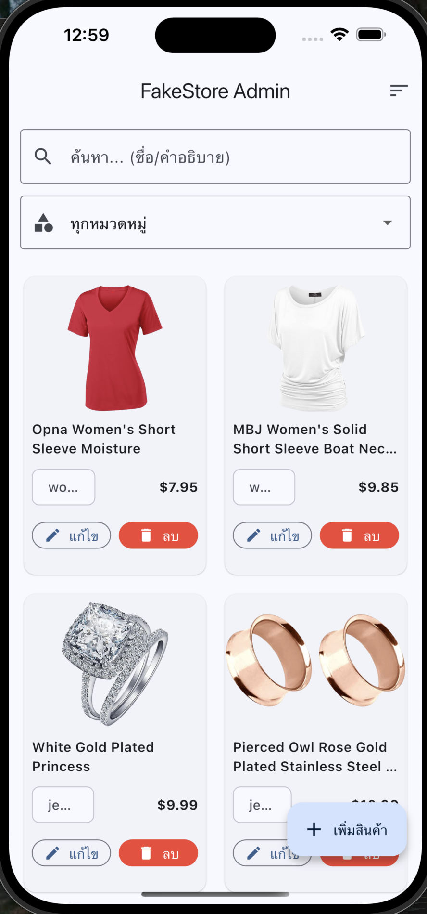
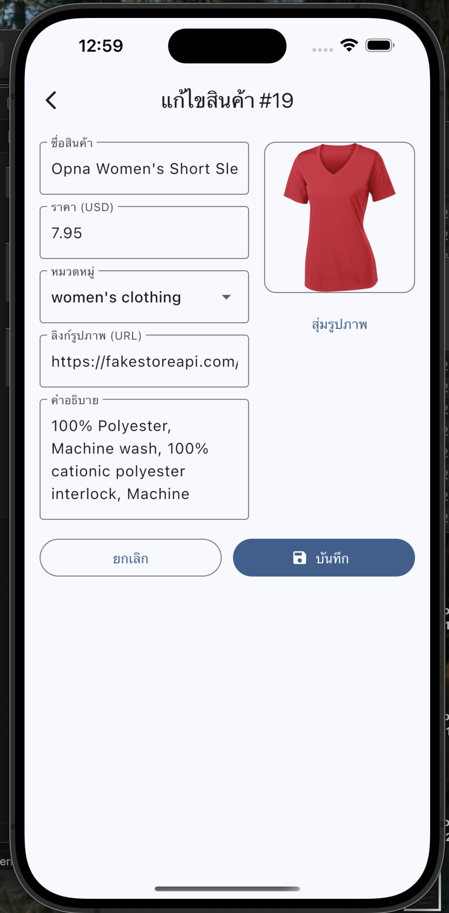
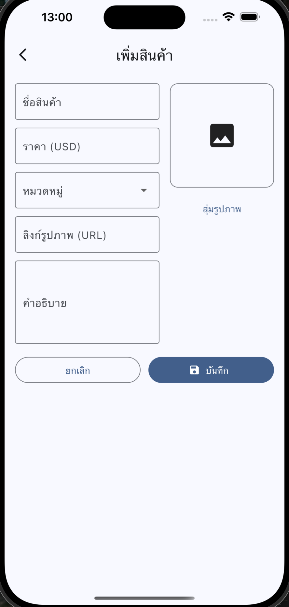

# 🛍️ FakeStore Admin (Flutter) 





> แอป Flutter ตัวอย่างสำหรับ **ฝึกทำ CRUD** กับสินค้า โดยใช้ **FakeStoreAPI** + จัดการสถานะด้วย **Provider**  
> รองรับจอแคบ/จอกว้าง (Responsive), ป้องกัน Overflow, และมีแนวทางต่อยอดจริงจัง 💪

---

## ✨ คุณสมบัติเด่น (Features)
- แสดงสินค้าใน **GridView** พร้อมรูป/ชื่อ/หมวดหมู่/ราคา
- ค้นหา (ชื่อ/คำอธิบาย), กรองตามหมวดหมู่, และ **เรียงราคาขึ้น/ลง**
- เพิ่ม/แก้ไข/ลบ สินค้า (CRUD) ผ่าน REST API
- **Responsive UI**: แถบเครื่องมือปรับ Row ↔ Column อัตโนมัติ, ปรับ `crossAxisCount` + `childAspectRatio`
- โค้ดแยกชั้นชัดเจน: **UI** / **Provider(State)** / **Service(API)** / **Model**

> ℹ️ **หมายเหตุ**: FakeStoreAPI เป็น mock สำหรับฝึก/ทดสอบ — POST/PUT/DELETE อาจไม่คงอยู่ถาวร

---

## 🧱 สถาปัตยกรรม (Architecture)

```mermaid
flowchart LR
  UI[Widgets & Screens] -->|listen() / notifyListeners()| Provider
  Provider -->|call| Service
  Service -->|HTTP| API[(FakeStore API)]
  Service --> Model[(Product)]
  Provider --> Model
  UI --> Model
```

- **UI**: จัดหน้า, รับอินพุตผู้ใช้ (ค้นหา/เลือกหมวด/กดปุ่ม CRUD)
- **Provider**: เก็บสถานะ, กรอง/เรียง, สั่งโหลดจาก Service แล้ว `notifyListeners()` ให้ UI รีเฟรช
- **Service**: เรียก REST API ด้วย `http`
- **Model**: แปลง JSON ↔ Dart object

---

## 📁 โครงสร้างโปรเจกต์

```
lib/
  main.dart                      # ตั้งค่า Provider + ธีม + หน้าแรก
  models/product.dart            # โมเดล Product (fromJson / toJson)
  services/api_service.dart      # เรียก API: GET/POST/PUT/DELETE
  providers/product_provider.dart# จัดการสถานะ/ค้นหา/กรอง/เรียง/CRUD
  screens/
    product_list_screen.dart     # หน้าแสดงรายการ + Toolbars + GridView
    product_form_screen.dart     # ฟอร์มเพิ่ม/แก้ไข (มีพรีวิวรูป)
  widgets/
    product_card.dart            # การ์ดสินค้า + ปุ่มแก้ไข/ลบ
```

---

## 🚀 เริ่มต้นอย่างรวดเร็ว (Quick Start)

```bash
flutter pub get
flutter run
```

> iOS จริง: ถ้าเห็นเตือน Local Network จาก DevTools → Settings → Privacy & Security → Local Network → อนุญาตแอป

---

## 🔗 Endpoints ที่ใช้ (API Cheat Sheet)

- หมวดหมู่: `GET /products/categories`
- รายการสินค้า + เรียง: `GET /products?sort=asc|desc`
- เพิ่มสินค้า: `POST /products`
- แก้ไขสินค้า: `PUT /products/{id}`
- ลบสินค้า: `DELETE /products/{id}`

---

## 🧠 การไหลของข้อมูล (Data Flow)

1. `main.dart` สร้าง `ProductProvider()` แล้วเรียก `load()` ตอนเริ่มแอป  
2. `ProductProvider.load()` →
   - `ApiService.fetchCategories()` → เก็บ `categories`
   - `ApiService.fetchProducts(sort)` → เก็บ `_all`
3. UI อ่าน `provider.items` (คำนวณจาก `_all` + คำค้น + หมวด + การเรียง)  
4. เพิ่ม/แก้ไข/ลบ → เรียก `ApiService` → อัปเดต `_all` → `notifyListeners()` → UI รีเฟรช

---

## 🧩 ตัวอย่างโค้ดสำคัญ

### 1) โมเดลสินค้า — `models/product.dart`
```dart
class Product {
  final int? id;
  String title;
  double price;
  String description;
  String category;
  String image;

  Product({
    this.id,
    required this.title,
    required this.price,
    required this.description,
    required this.category,
    required this.image,
  });

  factory Product.fromJson(Map<String, dynamic> json) => Product(
        id: json['id'] is int ? json['id'] : int.tryParse('${json['id']}'),
        title: json['title'] ?? '',
        price: (json['price'] is num) ? (json['price'] as num).toDouble() : 0.0,
        description: json['description'] ?? '',
        category: json['category'] ?? '',
        image: json['image'] ?? '',
      );

  Map<String, dynamic> toJson() => {
        'title': title,
        'price': price,
        'description': description,
        'image': image,
        'category': category,
      };
}
```

### 2) เรียก REST API — `services/api_service.dart`
```dart
class ApiService {
  static const String base = 'https://fakestoreapi.com';

  static Future<List<String>> fetchCategories() async {
    final res = await http.get(Uri.parse('$base/products/categories'));
    if (res.statusCode != 200) throw Exception('โหลดหมวดหมู่ไม่สำเร็จ');
    final List data = jsonDecode(res.body);
    return data.cast<String>();
  }

  static Future<List<Product>> fetchProducts({String sort = 'asc'}) async {
    final res = await http.get(Uri.parse('$base/products?sort=$sort'));
    if (res.statusCode != 200) throw new Exception('โหลดสินค้าล้มเหลว');
    final List data = jsonDecode(res.body);
    return data.map((e) => Product.fromJson(e)).toList();
  }

  static Future<Product> createProduct(Product p) async {
    final res = await http.post(
      Uri.parse('$base/products'),
      headers: {'Content-Type': 'application/json'},
      body: jsonEncode(p.toJson()),
    );
    if (res.statusCode >= 400) throw Exception('สร้างสินค้าไม่สำเร็จ');
    final Map<String, dynamic> data = jsonDecode(res.body);
    return Product.fromJson({...p.toJson(), 'id': data['id']});
  }

  static Future<Product> updateProduct(Product p) async {
    if (p.id == null) throw Exception('ไม่มีไอดีสินค้า');
    final res = await http.put(
      Uri.parse('$base/products/${p.id}'),
      headers: {'Content-Type': 'application/json'},
      body: jsonEncode(p.toJson()),
    );
    if (res.statusCode >= 400) throw Exception('อัปเดตสินค้าไม่สำเร็จ');
    return p; // FakeStoreAPI เป็น mock
  }

  static Future<void> deleteProduct(int id) async {
    final res = await http.delete(Uri.parse('$base/products/$id'));
    if (res.statusCode >= 400) throw Exception('ลบสินค้าไม่สำเร็จ');
  }
}
```

### 3) จัดการสถานะ — `providers/product_provider.dart`
```dart
class ProductProvider extends ChangeNotifier {
  List<Product> _all = [];
  List<String> _categories = [];
  String _query = '';
  String _selectedCategory = '';
  String _sort = 'asc';

  List<Product> get items {
    final q = _query.trim().toLowerCase();
    List<Product> list = _all.where((p) {
      final hit = p.title.toLowerCase().contains(q) ||
          p.description.toLowerCase().contains(q);
      final catOk = _selectedCategory.isEmpty || p.category == _selectedCategory;
      return hit && catOk;
    }).toList();
    list.sort((a, b) =>
        _sort == 'desc' ? b.price.compareTo(a.price) : a.price.compareTo(b.price));
    return list;
  }

  List<String> get categories => _categories;

  Future<void> load() async {
    _categories = await ApiService.fetchCategories();
    _all = await ApiService.fetchProducts(sort: _sort);
    notifyListeners();
  }

  void setQuery(String v) { _query = v; notifyListeners(); }
  void setCategory(String v) { _selectedCategory = v; notifyListeners(); }
  Future<void> setSort(String s) async {
    _sort = (s == 'desc') ? 'desc' : 'asc';
    _all = await ApiService.fetchProducts(sort: _sort);
    notifyListeners();
  }

  Future<void> add(Product p) async {
    final created = await ApiService.createProduct(p);
    _all.insert(0, created);
    notifyListeners();
  }

  Future<void> update(Product p) async {
    final updated = await ApiService.updateProduct(p);
    final idx = _all.indexWhere((e) => e.id == updated.id);
    if (idx >= 0) _all[idx] = updated;
    notifyListeners();
  }

  Future<void> remove(Product p) async {
    if (p.id == null) return;
    await ApiService.deleteProduct(p.id!);
    _all.removeWhere((e) => e.id == p.id);
    notifyListeners();
  }
}
```

### 4) UI หลัก (รายการสินค้า) — `screens/product_list_screen.dart`
```dart
// Responsive Toolbar
final isNarrow = width < 520;
Widget filters(BuildContext ctx) {
  final searchField = TextField(...);
  final categoryField = DropdownButtonFormField<String>(isExpanded: true, ...);

  return isNarrow
    ? Column(children: [searchField, SizedBox(height: 12), categoryField])
    : Row(children: [Expanded(flex: 2, child: searchField), SizedBox(width: 12), Expanded(child: categoryField)]);
}

// ปรับอัตราส่วนการ์ดตามความกว้างหน้าจอ
double tileAspect(width) {
  if (width < 360) return 0.56;
  if (width < 520) return 0.62;
  if (width < 800) return 0.70;
  return 0.80;
}
```

### 5) การ์ดสินค้า — `widgets/product_card.dart`
```dart
Column(
  children: [
    Expanded(flex: 5, child: Image.network(product.image, fit: BoxFit.contain)),
    Expanded(
      flex: 6,
      child: Column(
        children: [
          Text(product.title, maxLines: 2, overflow: TextOverflow.ellipsis),
          Row(...), // Chip(category) + ราคา
          Row( // ปุ่ม compact
            children: [
              Expanded(child: OutlinedButton.icon(...)),
              SizedBox(width: 8),
              Expanded(child: FilledButton.icon(...)),
            ],
          ),
        ],
      ),
    ),
  ],
)
```

---

## 🧪 UX & Responsive เคล็ดลับที่ใช้
- `DropdownButtonFormField(isExpanded: true)` + `ellipsis` กันอักษรล้น
- Row → Column บนจอเล็ก (ผ่าน MediaQuery) เลี่ยง overflow
- ปรับ `childAspectRatio` ของ Grid ให้สูงขึ้นบนจอแคบ
- ปุ่มแบบ **compact** ลดโอกาสล้นแนวตั้ง

---

## 🛠️ Troubleshooting
- **RenderFlex overflow**: ใช้ `isExpanded` ใน Dropdown, เปลี่ยน Row→Column, เพิ่ม `childAspectRatio`
- **DevTools Local Network (iOS)**: เปิดสิทธิ์ใน Settings → Privacy & Security → Local Network

---

## 🗺️ Roadmap
- Riverpod/Bloc, Pagination, Offline Cache (sqflite), Auth/Role, Tests, CI/CD

---

## 📄 License
โค้ดตัวอย่างเพื่อการศึกษา ใช้อิสระในงานเรียน/งานเดโมได้เลยครับ
